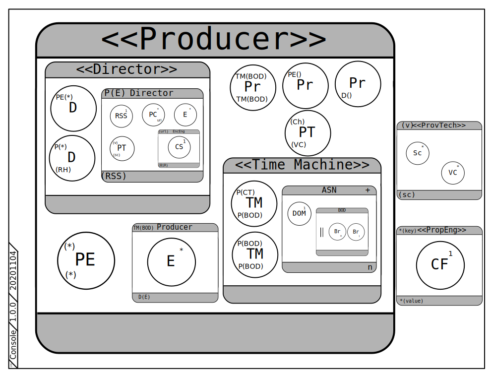

# Overview

## 0 Entry Point

The entry point to the application is the Console class's main method.

## 1 Modeling Scheme

Film production is the selected modeling scheme for this implementation, while also borrowing a few corporate terms as well.  This design approach was chosen because of the top heavy nature of the work distribution. 

## 2 Runtime Summary

### 2.0 Main

During execution, the activity in this general application can be described just using a producer, director and time machine object, with the producer one at the center.  The producer relegates time calculations to the time machine, and then assigns a unique proverb to said.  The director takes an ordered list of proverbs and creates an RSS file.

### 2.1 Auxiliary

A couple of ancillary roles exist to handle business related functions: technician, engineer, etc.  For the most part, these, such as, will hide technical details from the problem domain.

